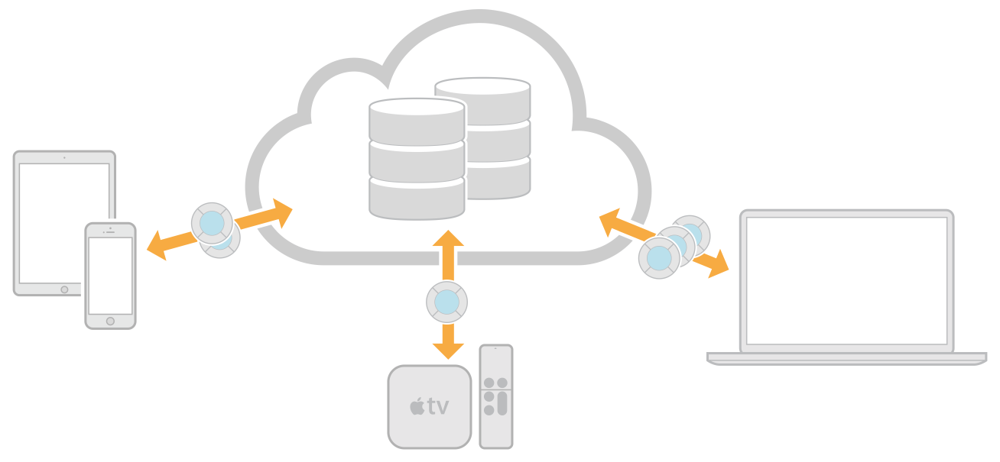

# 关于

本文档将帮助您开始创建一个CloudKit应用程序，该应用程序在iCloud中存储结构化应用程序和用户数据。使用CloudKit，由不同设备上的不同用户启动的应用程序实例可以访问存储在应用程序数据库中的记录。如果您希望在多个设备上运行的多个应用程序之间保留并共享模型对象，请使用CloudKit。这些模型对象作为 records 存储在数据库中，可由您或由用户提供。

您将学习如何：

* 在 Xcode 项目中启用 CloudKit，并以编程方式或使用 CloudKit 仪表板创建 schema
* 获取 records 并订阅代码中的更改
* 使用针对大型数据文件和位置数据进行了优化的字段类型
* 订阅 record 更改以提高性能
* 在将其上载到 App Store，Mac App Store 或 Apple TV App Store 之前，请在多个设备上测试您的 CloudKit 应用程序。
* 将架构部署到生产环境并使其与应用程序的每个版本保持同步

有关本书中使用的数据库[术语](https://developer.apple.com/library/archive/documentation/DataManagement/Conceptual/CloudKitQuickStart/Glossary/Glossary.html#//apple_ref/doc/uid/TP40014987-CH11-SW1)的定义，请参阅词汇表。

## 另请参见

以下WWDC会话提供了更多CloudKit体系结构和API详细信息：

* [WWDC 2014: Introducing CloudKit](https://developer.apple.com/videos/play/wwdc2014/208/) 简介介绍了用于保存和获取记录的基本体系结构和API。 
* [WWDC 2014: Advanced CloudKit](https://developer.apple.com/videos/play/wwdc2014/231/) 涵盖私有数据，自定义记录区域，确保数据完整性以及有效建模数据等主题。 
* [WWDC 2015: CloudKit Tips and Tricks](https://developer.apple.com/videos/play/wwdc2015-715/) 探索了一些鲜为人知的功能和订阅和查询的最佳实践。 
* [WWDC 2016: What's New with CloudKit](https://developer.apple.com/videos/play/wwdc2016/226/) 涵盖了新的共享API，可让您在iCloud用户之间共享私人数据。
* [WWDC 2016: CloudKit Best Practices](https://developer.apple.com/videos/play/wwdc2016/231/) CloudKit工程团队的最佳实践，介绍如何利用API和推送通知，以便为您的用户提供最佳体验。

以下文档描述了可用于访问与本机应用程序相同的数据的Web应用程序API：

* [_CloudKit JS Reference_](https://developer.apple.com/documentation/cloudkitjs) 描述了可用于从Web应用程序访问数据的JavaScript库。
* [_CloudKit Web Services Reference_](https://developer.apple.com/library/archive/documentation/DataManagement/Conceptual/CloudKitWebServicesReference/index.html#//apple_ref/doc/uid/TP40015240) 描述了可用于从Web应用程序访问数据的等效Web服务请求。

以下文档提供了有关相关主题的更多信息：

* 在 [_iCloud Design Guide_](https://developer.apple.com/library/archive/documentation/General/Conceptual/iCloudDesignGuide/Chapters/Introduction.html#//apple_ref/doc/uid/TP40012094) 中 [Designing for CloudKit](https://developer.apple.com/library/archive/documentation/General/Conceptual/iCloudDesignGuide/DesigningforCloudKit/DesigningforCloudKit.html#//apple_ref/doc/uid/TP40012094-CH9) 提供了CloudKit的概述。
* _App Distribution Quick Start_ 教您如何配置应用程序以进行开发并在设备上运行应用程序。
* _App Distribution Guide_ 包含所有配置步骤，包括配置应用程序服务和将应用程序提交到商店。
* [_Start Developing iOS Apps \(Swift\)_](https://developer.apple.com/library/archive/referencelibrary/GettingStarted/DevelopiOSAppsSwift/index.html#//apple_ref/doc/uid/TP40015214) 向您介绍Xcode以及创建基本iOS应用程序的步骤。 

