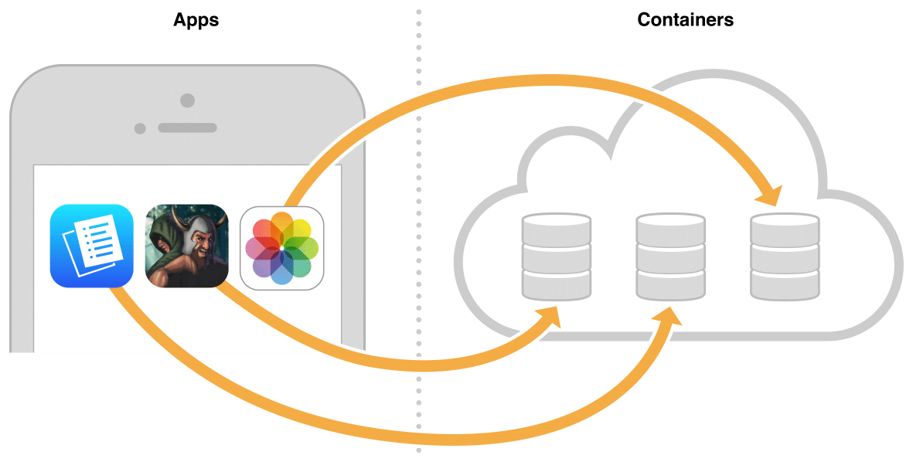

# 在您的应用中启用CloudKit

CloudKit是一种应用服务，仅适用于通过商店分发的应用。CloudKit需要在Xcode项目中进行其他配置。您的应用必须配置并进行代码签名才能访问CloudKit。要避免代码签名问题，请使用Xcode中的“功能”窗格启用CloudKit。您无需直接在Xcode或_developer.apple.com/account_上的[开发](https://developer.apple.com/account)_者帐户_中编辑权利。

### 关于容器和数据库

多个应用和用户可以访问iCloud，但数据被隔离并封装在称为_容器的_分区_中_。来自其他开发者的应用无法访问属于您的应用的容器。但是，您的应用可以共享容器。多个应用可以共享同一个容器，一个应用可以使用多个容器。每个应用程序有一个_默认容器_，但您可以创建其他_自定义容器_。默认容器的标识符与应用程序的包ID匹配。您指定的其他容器ID在所有开发者帐户中都必须是唯一的。

应用程序可以访问每个容器中的公共和私有数据库。的_公共数据库_是用于存储在所述应用程序的所有实例之间共享的用户和应用数据。默认情况下，所有用户都可以读取公共数据库，但是他们需要输入iCloud凭据才能写入公共数据库。您的应用的每个用户都有一个_私人数据库_，但该应用只能访问当前用户的私人数据库。用户必须为应用程序输入iCloud凭据才能读取和写入专用数据库。

### 建立

要执行本文档中的所有步骤，您需要：

* 安装了Xcode 6或更高版本的Mac计算机
* 为获得最佳体验，安装了最新的OS X和Xcode版本
* 一个无错误构建的Xcode项目
* Apple开发者计划的会员资格
* 在您的开发者帐户中启用CloudKit的权限

在开始使用CloudKit之前，请验证您是否已执行这些任务。有关分步说明，请阅读_App Distribution Quick Start_。

<table>
  <thead>
    <tr>
      <th style="text-align:left"></th>
      <th style="text-align:left">&#x4EFB;&#x52A1;</th>
    </tr>
  </thead>
  <tbody>
    <tr>
      <td style="text-align:left">
        
      </td>
      <td style="text-align:left">&#x52A0;&#x5165;Apple Developer Program&#x6216;Apple Developer Enterprise
        Program&#x3002;</td>
    </tr>
    <tr>
      <td style="text-align:left">
        
      </td>
      <td style="text-align:left">&#x521B;&#x5EFA;&#x4E00;&#x4E2A;&#x6784;&#x5EFA;&#x548C;&#x8FD0;&#x884C;&#x7684;Xcode&#x9879;&#x76EE;&#x3002;</td>
    </tr>
    <tr>
      <td style="text-align:left">
        
      </td>
      <td style="text-align:left">&#x5C06;Apple ID&#x6DFB;&#x52A0;&#x5230;&#x201C;&#x5E10;&#x6237;&#x201D;&#x504F;&#x597D;&#x8BBE;&#x7F6E;&#x3002;</td>
    </tr>
    <tr>
      <td style="text-align:left">
        
      </td>
      <td style="text-align:left">
        
&#x521B;&#x5EFA;&#x60A8;&#x7684;&#x56E2;&#x961F;&#x914D;&#x7F6E;&#x6587;&#x4EF6;&#xFF1A;

        <ul>
          <li>1.&#x5BF9;&#x4E8E;Mac&#x5E94;&#x7528;&#x7A0B;&#x5E8F;&#xFF0C;&#x8BF7;&#x9009;&#x62E9;Mac
            App Store&#x4F5C;&#x4E3A;&#x7B7E;&#x540D;&#x6807;&#x8BC6;&#x3002;</li>
          <li>2.&#x4ECE;&#x201C;&#x56E2;&#x961F;&#x201D;&#x5F39;&#x51FA;&#x83DC;&#x5355;&#x4E2D;&#x9009;&#x62E9;&#x60A8;&#x7684;&#x56E2;&#x961F;&#x3002;</li>
          <li>3.&#x5355;&#x51FB;&#x201C;&#x4FEE;&#x590D;&#x95EE;&#x9898;&#x201D;&#x3002;</li>
        </ul>
      </td>
    </tr>
    <tr>
      <td style="text-align:left">
        
      </td>
      <td style="text-align:left">&#x5BF9;&#x4E8E;Mac&#x5E94;&#x7528;&#x7A0B;&#x5E8F;&#xFF0C;&#x8BF7;&#x5728;&#x201C;&#x529F;&#x80FD;&#x201D;&#x7A97;&#x683C;&#x4E2D;&#x542F;&#x7528;App
        Sandbox&#x3002;</td>
    </tr>
  </tbody>
</table>如果成功完成上述任务，“常规”窗格中“团队”弹出菜单下方的错误消息和“修复问题”按钮将消失。下面的屏幕截图显示了成功创建代码签名资产后iOS应用程序的“常规”窗格。

有关创建团队配置文件的完整步骤，请阅读 _App Distribution Quick Start_。要解决代码签名和配置，读取故障诊断中_应用分发指南_。

### 启用iCloud并选择CloudKit

CloudKit是iCloud提供的三种应用服务之一。其他iCloud应用服务 - 键值存储和iCloud文档 - 也出现在Xcode的iCloud设置中。要使用CloudKit，首先启用iCloud，然后选择CloudKit服务。

**重要提示：**  当您选择CloudKit时，Xcode会根据包ID创建默认容器ID。由于无法删除iCloud容器，因此在选择CloudKit之前，请在Xcode的“常规”窗格中验证您的包ID是否正确。要更改捆绑包ID，请阅读在_App Distribution快速入门中_设置捆绑包ID。

**启用iCloud并选择CloudKit**

1. 在“功能”窗格中，选择iCloud行中的开关。

   Xcode规定您的应用使用iCloud。（默认情况下启用键值存储。）

2. 选择CloudKit复选框。

   Xcode根据捆绑包ID创建默认的CloudKit容器，并将CloudKit框架添加到您的项目中。

您的应用现在可以在iCloud中存储数据和文档。

### 访问CloudKit仪表板

使用CloudKit仪表板管理您的CloudKit容器架构和记录。该模式描述了数据库中记录，字段和关系的组织。记录是记录类型的实例。在关系数据库中，记录类型对应于表，而记录对应于表中的行。

**登录CloudKit仪表板**

1. 在“功能”窗格的iCloud设置中，单击“CloudKit仪表板”。

   或者，转到[https://icloud.developer.apple.com/dashboard](https://icloud.developer.apple.com/dashboard)。

2. 如有必要，请输入Apple ID凭据，然后单击“登录”。

   您所属的所有团队的所有容器都将显示在窗口中。

要注销，请从窗口右上角的“帐户”弹出菜单中选择“注销”。

### 在应用之间共享容器

（可选）将您的应用配置为使用多个容器或与其他应用共享容器。例如，您可以在内部使用一个应用程序以编程方式创建记录类型和记录，以将数据库返回到已知状态。此应用程序需要与您正在开发和测试的最终用户应用程序共享相同的容器。为此，您可以启用第一个应用程序以使用第二个应用程序的默认容器，或者创建两个应用程序共享的自定义容器。在不同平台（iOS，Mac和tvOS）上运行的应用程序也可以配置为共享相同的容器。

#### 将容器添加到应用程序

选择其他应用使用的现有容器ID或创建新应用。

**向应用添加容器**

   1.在iCloud设置下的“功能”窗格中，选择“指定自定义容器”。

      当您之前选择了CloudKit服务时，Xcode会为您的应用创建一个与捆绑ID匹配的默认容器ID。默认容器ID旁边会出现一个复选标记。

     2.如有必要，请单击“容器”表下方的“刷新”按钮，从您的开发者帐户下载其他应用程序使用的容器。

     3.在要添加的容器ID的行中，选中该复选框。

Xcode更新权利文件中的容器ID列表。

下面的屏幕截图显示了Curator应用程序共享Gallery应用程序的默认容器。

#### 创建自定义容器

或者，创建由多个应用共享的自定义容器。

**重要提示：**  只有团队管理员才能创建容器。如果您是个人，则您是一个团队的团队代理（具有管理员权限）。

**创建自定义容器**

   1.如果选择“使用默认容器”，请选择“指定自定义容器”。

   2.单击表底部的“添加”按钮（+）。

   3.在出现的对话框中，输入要添加的容器的标识符。

      **警告：**  您无法删除容器ID，因此请仔细选择容器ID。

      容器ID以`iCloud.`反向DNS表示法后面的字符串开头。

   4.单击确定。

       Xcode将新的容器ID添加到Xcode项目权利文件和开发人员帐户

如果要与其他应用程序共享新容器ID，请将容器添加到应用程序，如向应用程序[添加容器中](https://developer.apple.com/library/archive/documentation/DataManagement/Conceptual/CloudKitQuickStart/EnablingiCloudandConfiguringCloudKit/EnablingiCloudandConfiguringCloudKit.html#//apple_ref/doc/uid/TP40014987-CH2-SW9)所述。

#### 验证您的步骤

您可以在Xcode或您的开发者帐户的“功能”窗格中查看您团队的所有容器ID。在您的开发人员帐户中，您还可以添加容器并编辑容器名称。

**查看开发人员帐户中的容器ID**

1. 转到[证书，标识符和配置文件](https://developer.apple.com/account/ios/certificate)以及Mac应用程序，从左侧的弹出菜单中选择OS X.
2. 在“标识符”下，选择“iCloud容器”。
3. （可选）在右上角，单击搜索按钮，然后在搜索字段中输入文本。

### 创建用于开发的iCloud帐户

您需要一个iCloud帐户才能将记录保存到CloudKit容器中。您将在运行应用的设备上输入此iCloud帐户的凭据。如果您没有iCloud帐户，请创建一个可在开发期间使用的帐户。在Mac上，启动“系统偏好设置”并单击“iCloud”。单击Apple ID文本字段下的创建Apple ID，然后按照说明操作。

### 概括

在本章中，您学习了如何：

* 在Xcode项目中启用CloudKit，这将创建应用程序的默认容器。
* 访问CloudKit仪表板以查看容器的架构和记录。
* 创建用于开发的iCloud帐户。

